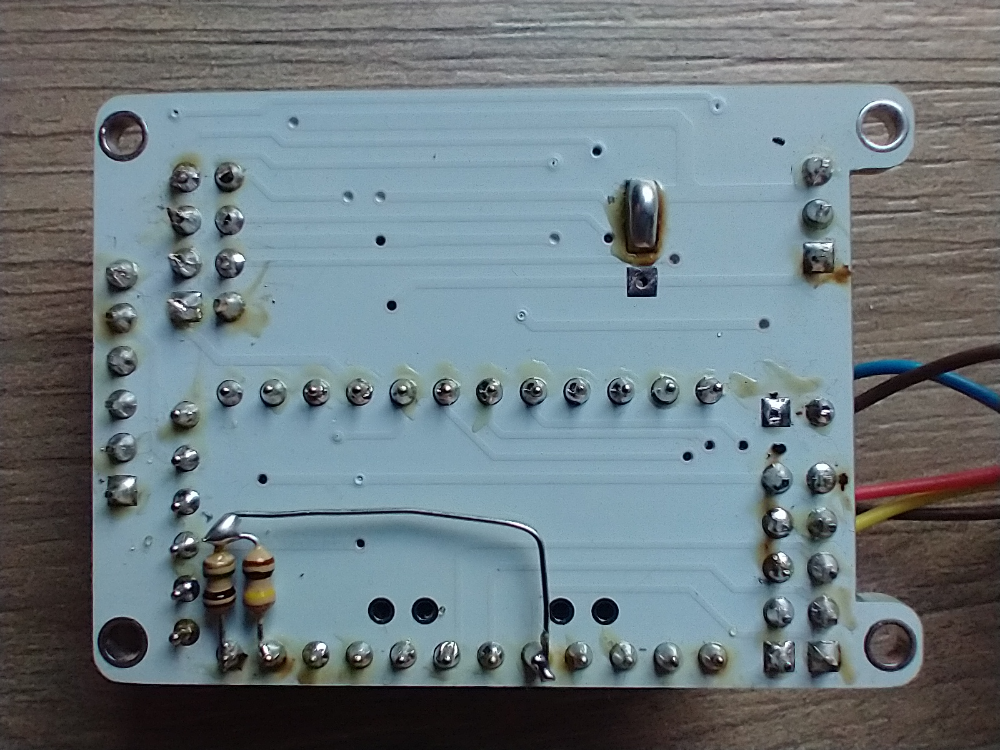

# nRF24L01_Arduino

by
http://marcelocampos.cc/

Placa projetada em KiCAD
https://kicad.org/

Pode ser utilizada com o excelente projeto IoT home Automation MySensors:
https://www.mysensors.org/hardware

---

Mod para medir bateria de alimentação

